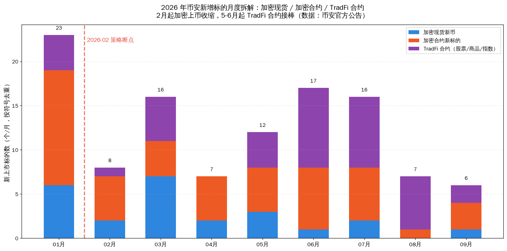
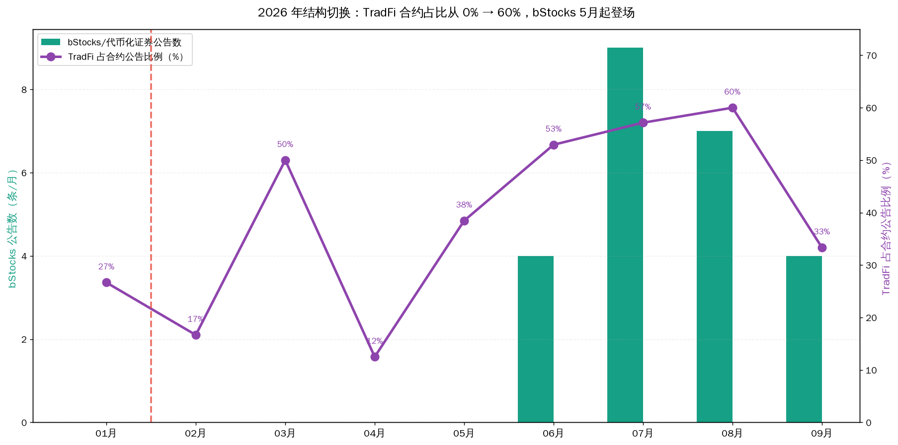
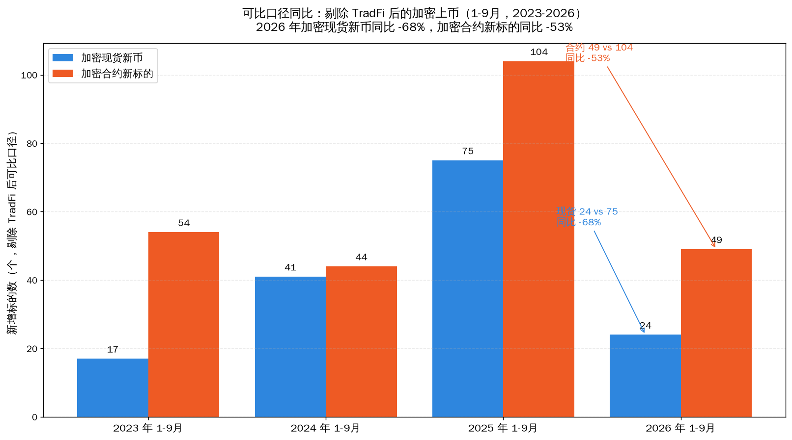

# 2026 币安上币策略转向：专项分析

> **报告类型**：数据支撑分析（内部运营参考）
> **作者**：代若川（MEXC 活动运营）
> **日期**：2026-09-12
> **数据源**：币安官方公告 API（catalogId=48，全量 2253 条，2017-07-21 → 2026-09-09）
> **定位**：本报告是《币安上币节奏 × 稳定币资金流》的**专项补充**——因为 2026 年的上币结构发生了断裂，直接与历史年份对比会得出错误结论，**必须单独分析**
> **口径**：市场结构观察，不构成投研建议

---

## 摘要（核心结论）

**2026 年 2 月是币安上币策略的断点，5-6 月完成切换。** 这一年不能和往年混算。

| 核心发现 | 数据 |
|---|---|
| ① **断点确认在 2026-02** | 加密合约公告 1 月 15 条 → 2 月 6 条；首个「Multiple Equity Perpetual Contracts」出现在 **2 月 5 日** |
| ② **加密现货新币坍缩** | 1-9 月 **24 个 vs 2025 年同期 75 个，同比 −68%** |
| ③ **加密合约砍半，但总产能没减** ⭐ | 加密合约 104 → 49（−53%），但 TradFi 接了 39+ 个 → **总产能持平，是"置换"不是"收缩"** |
| ④ **TradFi 从 0 到主力** | TradFi 占合约公告比例：1 月 27% → **6-8 月 53-60%** |
| ⑤ **代币化证券（bStocks）5 月登场** | 公告 0 条 → 5 月起累计 **24 条**（6 月单月 9 条） |
| ⑥ **剩下的现货几乎全是小市值** | Seed Tag 标签占比：2025 年 13% → **2026 年 71%** |

**一句话**：币安没有减少"上币"这个动作，而是把上币的**产能和注意力，从加密资产搬到了 TradFi 资产**。

---

## 一、断点定位：为什么是 2026 年 2 月

### 1.1 1 月 vs 2 月的断崖

| 指标 | 2026-01 | 2026-02 | 变化 |
|---|---|---|---|
| 上币公告总数 | 36 条 | 14 条 | **−61%** |
| 合约公告数 | 15 条 | 6 条 | −60% |
| 加密合约新标的 | 13 个 | 5 个 | −62% |
| 加密现货新币 | 6 个 | 2 个 | −67% |
| **TradFi 类合约** | 4 个 | **首个「Multiple Equity Perpetual」** | 新品线出现 |

### 1.2 时间线（数据实证）

| 时间 | 事件 | 意义 |
|---|---|---|
| 2026-01-26 | `TSLAUSDT Equity Perpetual Contract` | 股票永续试水 |
| 2026-01-30 | `XPTUSDT / XPDUSDT`（铂/钯）、`INTCUSDT / HOODUSDT Equity Perpetual` | 商品+股票同步铺 |
| **2026-02-05** | **`Multiple USDⓈ-Margined Equity Perpetual Contracts`** | **批量发行模式开始 = 策略切换信号** |
| 2026-03-12/16 | `EWYUSDT / EWJUSDT Index Perpetual`（韩国/日本 ETF） | 指数类进场 |
| 2026-03-30 | `CLUSDT / BZUSDT / NATGASUSDT`（原油/布伦特/天然气） | 能源类进场 |
| **2026-05 起** | **`Multiple USDⓈ-Margined TradFi Perpetual Contracts` 高频出现（5月起 31 条）** | **TradFi 成为常规产品线** |
| 2026-05 | 首条 bStocks / 代币化证券公告 | 现货侧也开始 TradFi 化 |
| 2026-08-12 | 币安钱包上线「股票专区」（公开报道） | 产品线整合完成 |

> 📌 **判读**：2 月是"试水结束、转入批量"的转折点；5-6 月是"新产品线成为主力"的确认点。用户观察到的"2 月调整"在数据上完全成立。

---

## 二、2026 月度拆解（本报告核心表）

| 月份 | 加密现货新币 | 加密合约新标的 | TradFi 合约 | **合计** | TradFi 占合约公告 | bStocks 公告 |
|---|---|---|---|---|---|---|
| 2026-01 | 6 | 13 | 4 | **23** | 27% | 0 |
| **2026-02** | 2 | 5 | 1 | **8** | 17% | 0 |
| 2026-03 | 7 | 4 | 5 | **16** | 50% | 0 |
| 2026-04 | 2 | 5 | 0 | **7** | 12% | 0 |
| 2026-05 | 3 | 5 | 4 | **12** | 38% | 0 |
| 2026-06 | 1 | 7 | 9 | **17** | **53%** | 4 |
| 2026-07 | 2 | 6 | 8 | **16** | **57%** | 9 |
| 2026-08 | 0 | 1 | 6 | **7** | **60%** | 7 |
| 2026-09（至9日） | 1 | 3 | 2 | **6** | 33% | 4 |
| **1-9 月合计** | **24** | **49** | **39** | **112** | — | **24** |

> 口径说明：加密现货/合约按 token 符号去重（**已剔除 bStocks 与 TradFi**）；TradFi 合约 = 可解析符号（8 个：XAG/XPT/XPD/INTC/COPPER/CL/BZ/NATGAS）+ 复合公告（31 条，每条约含 2-5 个合约，**实际数量高于表中值**）。
> ⚠️ 本表与主报告《币安上币节奏 × 稳定币资金流》的月度表**数字略有差异属正常**：主报告未做 bStocks/TradFi 拆分（现货含代币化证券、合约不含复合公告）。**做 2026 分析必须用本表口径**，否则加密上币数会被 TradFi 污染。

---

## 三、四个结构性变化

### 变化一：加密现货新币同比 −68%

| 期间（1-9月） | 加密现货新币 | 同比 |
|---|---|---|
| 2023 | 17 | —（熊市底部） |
| 2024 | 41 | +141% |
| 2025 | 75 | +83% |
| **2026** | **24** | **−68%** |

**2026 年的现货上币量，已经回落到 2023 年熊市底部的水平（24 vs 17）**——而 2026 的资金面（+20.5M/天）明显好于 2023（−57M/天）。**这说明现货上币的收缩不只是行情原因。**

### 变化二：加密合约砍半，但总产能没减 ⭐ 最关键

| 期间（1-9月） | 加密合约新标的 | TradFi 合约 | **合约总线** |
|---|---|---|---|
| 2024 | 44 | 0 | ~44 |
| 2025 | 104 | 0 | ~110 |
| **2026** | **49**（−53%） | **39+** | **~119-150** |

> 估算说明：TradFi 的 31 条「Multiple ... Perpetual Contracts」按每条 2-3 个合约估算，故总线为区间值。**加密单符号合约 57 个（含 TradFi 8 个）是硬数据。**

**结论：币安合约上新的"产能"没有下降，而是从加密资产置换到了 TradFi 资产。** 加密合约砍掉的 55 个位置，基本被 TradFi 填满了。

这印证了主报告的发现：**合约上线与加密资金流几乎无关（r≤0.25），是独立的战略管线**。2026 年的转向进一步证明——合约上什么标的，取决于币安的产品战略，不取决于加密市场的资金面。

### 变化三：TradFi 从 0 到主力产品线

| 月份 | TradFi 占合约公告比 |
|---|---|
| 1-2 月 | 17-27%（试水期） |
| 3 月 | 50% |
| **5-8 月** | **38% → 53% → 57% → 60%（主力期）** |

**TradFi 覆盖品类**（2026 年实证）：
- **股票**：TSLA、INTC、HOOD、PAYP…及 31 条复合公告中的批量标的
- **商品**：XAG（银）、XPT（铂）、XPD（钯）、COPPER（铜）、CL（原油）、BZ（布伦特）、NATGAS（天然气）
- **指数**：EWY（韩国 ETF）、EWJ（日本 ETF）

**同时现货侧也在 TradFi 化**：bStocks / 代币化证券公告从 0 条 → 24 条（5 月起），2026-08-12 币安钱包上线「股票专区」把这些产品整合到一个入口。

### 变化四：剩下的现货几乎全是小市值

| 年份（1-9月） | 现货新币 | 其中带 Seed Tag | **Seed Tag 占比** |
|---|---|---|---|
| 2024 | 41 | 16 | 39% |
| 2025 | 75 | 10 | 13% |
| **2026** | **24** | **17** | **71%** |

**这是个反直觉发现**：币安 2026 年的现货上币数量少了，但**小市值（Seed Tag）币的绝对数量反而没减（17 vs 10），占比从 13% 飙到 71%**。

**解读**：币安并没有"放弃小市值加密资产"，而是**把现货上币的定位收缩为"高波动小市值 + 代币化证券"两条腿**——中间层（中等市值主流项目）几乎不再上现货。

---

## 四、为什么会发生这个转向（三个层面）

**① 收入结构层面**：交易所的收入基础正从「加密市场成交量」切换到「全球金融市场成交量」。当交易标的从 BTC/ETH 扩展到英伟达、苹果、黄金、原油、标普 500，收入天花板就不再受加密市场总市值限制。（行业共识：UEX / 全景交易所）

**② 竞争层面**：Perp DEX（Hyperliquid、Aster）在链上抢加密资产的合约交易；CEX 在加密合约上的边际优势下降，而在 TradFi 合约上有牌照/结算/流动性承接的结构性优势。

**③ 加密供给层面**：2026 年资金面疲弱（+20.5M/天，C 档），新加密项目上现货的"财富效应"下降，上币的边际收益变低。

---

## 五、对 MEXC 的运营启示 ⭐

### 5.1 机会：加密新资产的供给真空

**币安 2026 年把新增标的产能从加密腾给了 TradFi，这意味着加密新资产的首发竞争压力下降了。**

| 机会点 | 依据 | 建议动作 |
|---|---|---|
| **承接币安不再覆盖的加密标的** | 币安现货新币 −68%，中间层项目几乎不再上现货 | 我们的现货上币清单可以更积极，抢"币安不上但社区活跃"的项目 |
| **中小市值仍是币安在做的品类** | Seed Tag 占比 71%，绝对数 17 个/9 月 | 竞争仍在，但对手注意力分散（在忙 TradFi）→ **我们的首发窗口变大** |
| **合约标的储备的窗口** | 币安合约产能转向 TradFi，加密合约砍半 | 熊市储备加密合约标的（主报告结论：熊市是囤合约期） |

### 5.2 预警：TradFi 是长期趋势，MEXC 迟早要跟

币安的路径清晰：**加密合约 → TradFi 合约 → 代币化证券 → 钱包股票专区**。这是行业级转向（Aster、Grvt、Kraken、HelloTrade 都在做）。

**对我们的含义**：
- 短期（6 个月内）：这是**我们的抢量窗口**——对手在转型期会分心
- 中期（1 年内）：如果 MEXC 不做 TradFi 品类，会在"全景交易所"竞争中处于结构性劣势
- **建议**：即使现在不做，也应把 TradFi 合约/代币化证券的**可行性研究**排进日程（牌照、清算、流动性来源）

### 5.3 监测指标（专为 2026 转向设计）

| # | 指标 | 当前值 | 阈值/含义 |
|---|---|---|---|
| 1 | 币安加密现货新币/月 | 1-3 个 | <1 = 基本退出；>5 = 回归 |
| 2 | 币安加密合约新标的/月 | 1-7 个 | 与 TradFi 的此消彼长 |
| 3 | **TradFi 占币安合约公告比** | **33-60%** | >50% 持续 = 转向已成定局 |
| 4 | 币安 bStocks 公告数/月 | 4-9 条 | 加速 = 现货侧 TradFi 化 |
| 5 | 币安 Seed Tag 占现货比 | 71% | 反映其现货定位 |
| 6 | 稳定币日均净流入 | +20.5M（C 档） | 见主报告 S/A/B/C/D 分级 |

---

## 六、图表

| 图 | 文件 | 内容 |
|---|---|---|
| 图10 | `charts/10-2026-monthly-breakdown.png` | 2026 月度拆解：加密现货/加密合约/TradFi 堆叠 + 断点标注 |
| 图11 | `charts/11-2026-tradfi-share.png` | TradFi 占合约比曲线 + bStocks 公告数 |
| 图12 | `charts/12-2026-yoy-comparison.png` | 可比口径同比（1-9月，2023-2026，剔除 TradFi） |

### 图10：2026 月度拆解



### 图11：TradFi 占比 + bStocks



### 图12：可比口径同比



---

## 七、复现方式

```bash
# 1. 重抓币安公告（需 runner，或服务器可访问 www.binance.com）
bash ~/hermes-skills/ci/binance-listings.sh

# 2. 重画 2026 专项图表
/home/ubuntu/.venv-charts/bin/python ~/hermes-skills/mexc/charts/make_2026_charts.py

# 3. 报告 → PDF
cd ~/hermes-skills/mexc
/home/ubuntu/.venv-charts/bin/python scripts/md2pdf.py 2026-listing-strategy-shift.md 2026-listing-strategy-shift
```

**数据文件**：`data/binance-announcements/classified.csv`（2253 条标注公告）

---

## 八、结论

> **2026 年 2 月是币安从"加密交易所"走向"全景交易所"的断点。**
>
> 数据给出了三个铁证：**加密现货新币 −68%**、**加密合约 −53%**、**TradFi 从 0 变成占合约公告 60%**。
> 但**合约总产能没有下降**——这是一场**置换**，不是**收缩**。
>
> 对我们的意义是双面的：
> **短期，对手在转型期分心，加密新资产的供给真空是我们的窗口；**
> **长期，如果行业真的转向全景交易所，不做 TradFi 的一方会被结构性边缘化。**
>
> 窗口期通常比想象中短——因为它不是由行情决定，而是由**对手的战略决心**决定。

---

*本报告数据全部来自币安官方公开公告 API，可逐条核验。市场结构观察，不构成投研建议。*
