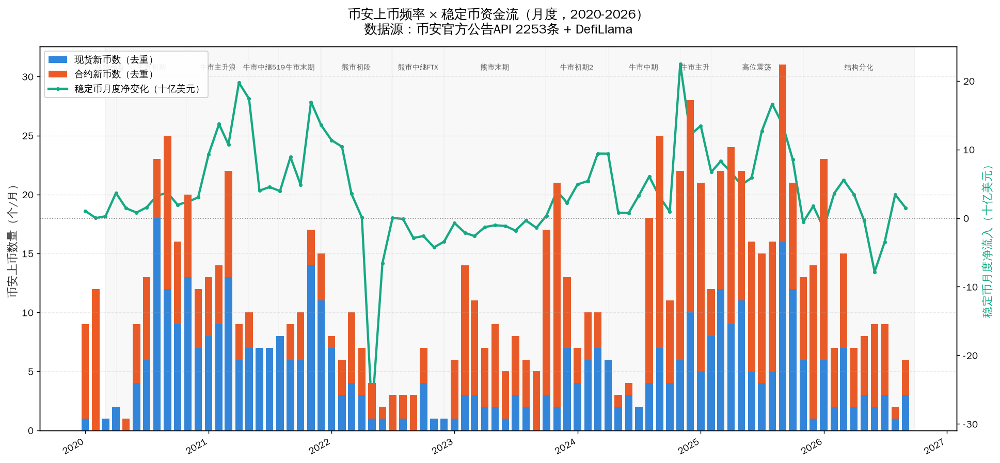
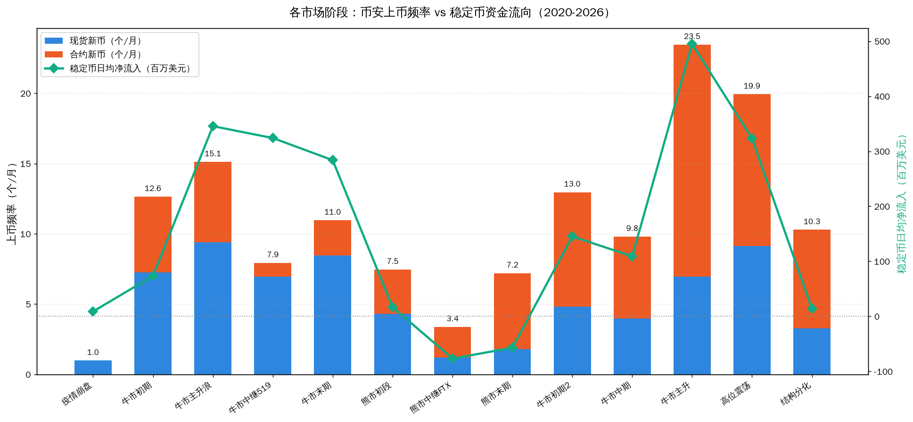
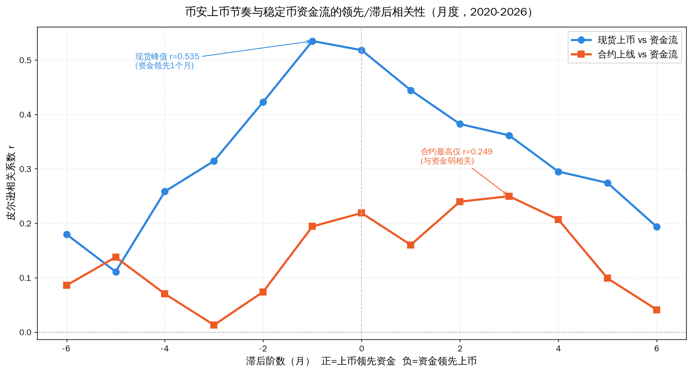
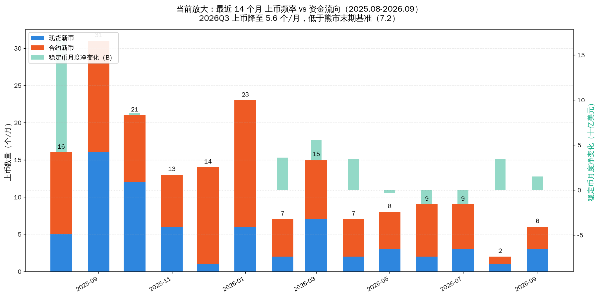
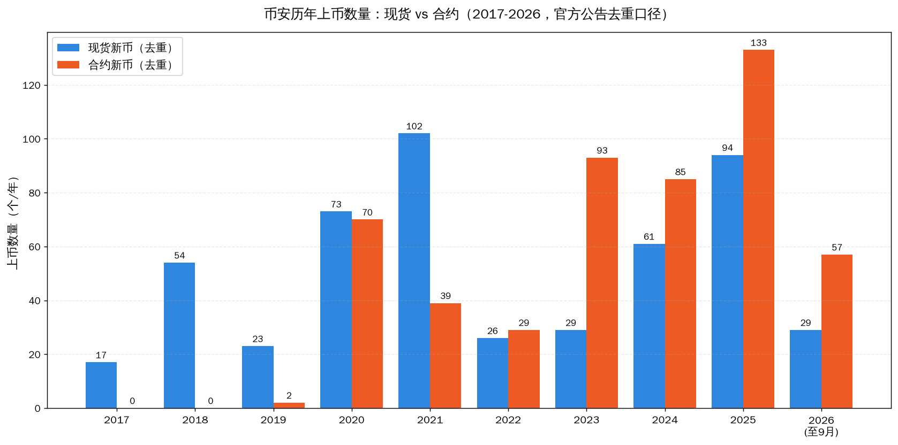
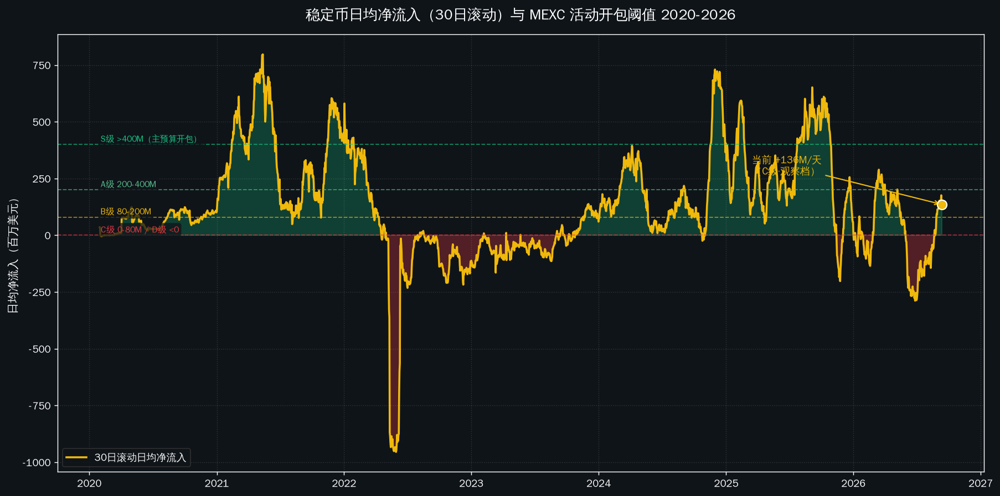

# 币安上币节奏 × 稳定币资金流：数据分析报告（2020-2026）

> **报告类型**：数据支撑分析（内部运营参考）
> **作者**：代若川（MEXC 活动运营）
> **日期**：2026-09-12
> **用途**：活动开包时机量化依据 / 预算分级校准 / 上币协同窗口判断
> **口径**：市场结构观察，不构成投研建议

---

## 摘要（一页版）

本报告用两套**可公开复核的硬数据**回答一个运营问题：**什么时候该开大活动？**

| 数据 | 来源 | 覆盖 | 规模 |
|---|---|---|---|
| 稳定币资金流 | DefiLlama 稳定币市值日度 | 2017-11-29 → 2026-09-12 | 3210 天 |
| 币安上币台账 | **币安官方公告 API**（catalogId=48） | 2017-07-21 → 2026-09-09 | **2253 条逐条公告** |

### 六个核心结论

1. **稳定币日均净流入是最佳"开包总闸门"**：>400M/天 = 牛市主升（开大包），<0 = 熊市（收预算）。**当前 +20.5M（C 级观察档）。**

2. **币安上币节奏是极强的趋势放大器**：牛市主升 23.5 个/月 vs 熊市中继 3.4 个/月，**极差 6.9 倍**。

3. **现货上币跟随资金，不是提前布局** ⭐：资金领先现货上币约 **1 个月（r=0.535）**。原"币安有前瞻性"假设在现货层面**不成立**。

4. **合约上线与资金流几乎无关**（r≤0.25）：合约是**独立产品管线**。2023 年熊市最深时币安上线 93 个合约（现货仅 29）——**熊市是合约囤货期，不是停工期**。

5. **当前（2026Q3）上币闸门已收到极紧**：5.6 个/月，**低于熊市末期基准 7.2**。资金 +16.3M/天属 C 档。**结论：现在不是靠增量资金做活动的时点。**

6. **对 MEXC 的可操作窗口**：资金流入转正的**第一个月**是最佳抢跑点——此时币安还没反应，我们早它 3-4 周。

---

## 一、数据与方法（先说清边界）

### 1.1 两套数据源

| 数据项 | 来源 | 可得性 | 可信度 |
|---|---|---|---|
| 稳定币总市值（日度） | DefiLlama `stablecoins.llama.fi/stablecoincharts/all` | ✅ 完整 3210 天 | **高**（业界标准） |
| 币安上币公告（逐条+毫秒时间戳） | 币安官方公告 API `catalogId=48` | ✅ 全量 2253 条 | **高**（一手官方） |
| 稳定币"流入交易所"金额 | — | ❌ 不可得（CryptoQuant/Glassnode 付费） | 用市值变化代理 |

> 💡 **口径说明**：稳定币市值变化 = 铸造 − 赎回 ≈ **场外资金进出加密市场的净额**（不含交易所内部转账）。这是免费数据里最接近"资金流入"的指标。

### 1.2 上币数据的三点口径边界（诚实标注）

1. **去重口径**：按公告标题括号内的 token 符号去重，同一币的"Will List"+"Add on Earn"两条公告合并为 **1 个上币事件**。
2. **现货上币**含 `Will List` 与 `Add on Earn/Convert/Margin` 两类公告（后者是新币上架流程的一部分）。
3. **合约口径**：USDT 永续合约按符号去重，**不含**季度交割合约；另有 35 条"Multiple ... Perpetual Contracts"复合公告无法拆分（估算遗漏 2-4%）。
4. 极少数 2017-2018 年措辞特殊的公告可能漏计。

### 1.3 取数管道（GFW 环境下的实现）

```
GitHub Actions runner（不受 GFW 限制）
  → 直连 www.binance.com/bapi/... 抓公告（api.binance.com 对 runner 报 451，www 开放）
  → commit 回 egak09/hermes-skills
  → 服务器 git pull
```
备用通道：Cloudflare Worker 代理（`http-proxy.skyproxy2026.workers.dev`），密钥内置在 Worker 环境变量。

---

## 二、稳定币资金流全景（2017-2026）

### 2.1 长期规模

| 时点 | 稳定币总市值 | 说明 |
|---|---|---|
| 2017-11（数据起点） | ~$0.1B | 仅 USDT 早期 |
| 2021-11（上一轮峰值） | ~$163B | 牛市顶 |
| 2022-11（FTX 底部） | ~$138B | 熊市低点 |
| **2026-05-17（历史峰值）** | **$322.4B** | 本轮高位 |
| **2026-09-12（当前）** | **$311.8B** | 较峰值 **-3.3%** |

### 2.2 单日极值事件

| 类型 | 日期 | 金额 | 事件 |
|---|---|---|---|
| **单日最大流出** | 2022-05-12 | **-15.96B** | LUNA/UST 崩盘 |
| 单日流出 | 2022-05-09 | -5.45B | LUNA 脱锚 |
| 单日流出 | 2023-03-12 | -2.79B | USDC 脱锚（SVB） |
| 单日流出 | 2021-08-24 | -2.39B | 阶段性回调 |
| **单日最大流入** | 2022-01-02 | **+5.10B** | 年初资金进场 |
| 单日流入 | 2023-03-13 | +3.54B | USDC 危机后回流 |
| 单日流入 | 2021-06-01 | +3.38B | 519 后抄底 |

### 2.3 十三个市场阶段

| 市场阶段 | 时间 | 阶段净变化 | **日均净流入** | 判读 |
|---|---|---|---|---|
| 疫情崩盘 | 2020.03 | +0.3B | +9.1M | 资金观望 |
| **牛市初期**（DeFi Summer） | 2020.04-10 | +15.7B | **+73.7M** | 温和流入，趋势启动 |
| **牛市主升浪** | 2020.11-2021.04 | +62.5B | **+347.5M** | 🔥 强流入 |
| **牛市中继**（519暴跌） | 2021.05-07 | +29.8B | **+327.6M** | 暴跌但资金不撤 |
| **牛市末期**（双顶） | 2021.08-11 | +34.6B | **+286.2M** | 仍强流入，但见顶 |
| 熊市初段（LUNA前） | 2021.12-2022.06 | +3.5B | +16.8M | 流入骤停 |
| **熊市中继**（FTX） | 2022.07-11 | **-11.7B** | **-77.3M** | ❄️ 净流出 |
| **熊市末期**（监管冻结） | 2022.12-2023.09 | **-17.3B** | **-57.2M** | ❄️ 持续流出 10 个月 |
| **牛市初期**（ETF预期） | 2023.10-2024.03 | +26.6B | **+146.1M** | 拐点确认，加速 |
| 牛市中期（减半后震荡） | 2024.04-10 | +23.3B | +109.6M | 中速流入 |
| **牛市主升**（特朗普行情） | 2024.11-2025.01 | +45.6B | **+500.6M** | 🔥🔥 历史最强 |
| 高位震荡 / 1011 崩盘 | 2025.02-10 | +88.3B | +324.5M | 强流入伴随高波动 |
| **结构分化期（当前）** | 2025.11-2026.09 | +4.7B | **+14.9M** | ⚠️ 接近停滞 |

### 2.4 三条资金规律

**规律 A：日均净流入有清晰的五档区间**

| 日均净流入 | 历史对应 | 市场状态 |
|---|---|---|
| **> +400M** | 2021Q1/Q2/Q4、2024Q4、2025Q3 | 🔥 牛市主升 |
| **+200~400M** | 2021Q3、2022Q1、2024Q1、2025Q1-Q2 | 牛市中段 |
| **+80~200M** | 2020Q3-Q4、2024Q2-Q3、2025Q4、2026Q1 | 初期/震荡 |
| **0~+80M** | 2020Q1、2023Q4、**2026Q3（当前）** | 转折/停滞 |
| **< 0** | 2022Q2-Q4、2023 全年、**2026Q2** | ❄️ 熊市/收缩 |

**规律 B：牛熊转换的先行信号是"流入骤停"，不是价格下跌**
- 2025Q4 从 +486M/天 掉到 +103M/天 → 随后 10.11 崩盘
- 2023Q4 仅回升到 +72M/天 → 对应牛市起点（**转正不需要很强**）

**规律 C：牛市里的"中继"不吓人，熊市里的"反弹"不能追**
- 2021Q2（519 腰斩）资金仍 +510M/天 → 后续创新高（中继）
- 2022Q1（熊市初段反弹）资金 +283M/天**但这是滞后数据** → 随后 Q2 崩盘 -378M（陷阱）

---

## 三、币安上币全景（2017-2026）

### 3.1 历年上币数量（硬数据，可逐条核验）

| 年份 | 现货新币 | 合约新币 | 合计 | 市场背景 |
|---|---|---|---|---|
| 2017 | 17 | — | 17 | 币安成立，只做现货 |
| 2018 | 54 | — | 54 | ICO 泡沫末期 |
| 2019 | 23 | 2 | 25 | 深熊，首次试水合约 |
| **2020** | 73 | 70 | 143 | 🔥 牛初，合约业务爆发 |
| **2021** | **102** | 39 | 141 | 🔥🔥 现货上币史上最多 |
| 2022 | 26 | 29 | 55 | ❄️ 熊市，上币骤降 |
| 2023 | 29 | **93** | 122 | ❄️ 熊末，**合约逆势扩张** |
| 2024 | 61 | 85 | 146 | ETF 牛市 |
| **2025** | **94** | **133** | **227** | 🔥 史上最高 |
| 2026（至9月） | 29 | 57 | 86 | ⚠️ 年化约 115，明显收缩 |

**结构转折**：**2023 年起合约上币数持续超过现货**（93>29 / 85>61 / 133>94）。合约已成为币安扩张的主体。

### 3.2 季度明细

| 季度 | 现货 | 合约 | 合计 | 稳定币日均 | 阶段 |
|---|---|---|---|---|---|
| 2020Q1 | 2 | 20 | 22 | +14.7M | 疫情冲击 |
| 2020Q2 | 6 | 6 | 12 | +65.3M | 复苏 |
| 2020Q3 | 36 | 25 | 61 | +86.2M | 牛市初期 |
| 2020Q4 | 29 | 19 | 48 | +86.0M | 初期→主升 |
| **2021Q1** | 30 | 19 | 49 | **+399.9M** | 🔥 主升 |
| 2021Q2 | 20 | 6 | 26 | **+509.9M** | 🔥🔥 峰值 |
| 2021Q3 | 21 | 3 | 24 | +189.2M | 反弹中继 |
| 2021Q4 | 31 | 11 | 42 | +393.9M | 末期新高 |
| 2022Q1 | 14 | 10 | 24 | +282.5M | 熊市初段 |
| **2022Q2** | 5 | 8 | 13 | **-378.3M** | ❄️ LUNA |
| 2022Q3 | 1 | 8 | 9 | -35.2M | 熊市中继 |
| 2022Q4 | 6 | 3 | 9 | -119.4M | ❄️ FTX |
| 2023Q1 | 7 | **24** | 31 | -62.3M | ❄️ 熊市末期 |
| 2023Q2 | 5 | 16 | 21 | -39.0M | ❄️ 熊市末期 |
| 2023Q3 | 5 | 14 | 19 | -39.9M | ❄️ 监管冻结 |
| 2023Q4 | 12 | 39 | 51 | +71.9M | 拐点（ETF预期） |
| 2024Q1 | 17 | 10 | 27 | +225.7M | ETF 通过 |
| 2024Q2 | 11 | 2 | 13 | +124.5M | 减半 |
| 2024Q3 | 13 | 32 | 45 | +132.8M | 中期震荡 |
| **2024Q4** | 20 | 41 | 61 | +363.8M | 🔥 特朗普行情 |
| 2025Q1 | 25 | 30 | 55 | +331.7M | 牛市末段 |
| 2025Q2 | 25 | 37 | 62 | +197.4M | 高位震荡 |
| **2025Q3** | 25 | 37 | 62 | **+485.9M** | 🔥🔥 高位扩张 |
| 2025Q4 | 19 | 29 | 48 | +103.2M | 1011 崩盘 |
| 2026Q1 | 15 | 30 | 45 | +82.7M | 结构分化 |
| 2026Q2 | 7 | 17 | 24 | **-47.5M** | ❄️ 资金转出 |
| **2026Q3（当前）** | **7** | **10** | **17** | **+20.5M** | ⚠️ 双低 |

---

## 四、交叉分析（本报告核心）

### 4.1 市场阶段对照表 ⭐ 最初的问题

| 市场阶段 | 时间 | 天数 | 现货 | 合约 | **上币/月** | **日均净流入** |
|---|---|---|---|---|---|---|
| 疫情崩盘 | 2020.03 | 31 | 1 | 0 | 1.0 | +8.8M |
| **牛市初期** | 2020.04-10 | 214 | 51 | 38 | **12.6** | +73.4M |
| **牛市主升浪** | 2020.11-2021.04 | 181 | 56 | 34 | **15.1** | +345.6M |
| 牛市中继（519） | 2021.05-07 | 92 | 21 | 3 | 7.9 | +324.0M |
| 牛市末期（双顶） | 2021.08-11 | 122 | 34 | 10 | 11.0 | +283.8M |
| 熊市初段 | 2021.12-2022.06 | 212 | 30 | 22 | 7.5 | +16.7M |
| **熊市中继（FTX）** | 2022.07-11 | 153 | 6 | 11 | **3.4** 🔻 | **-76.8M** |
| **熊市末期** | 2022.12-2023.09 | 304 | 18 | **54** | 7.2 | **-57.0M** |
| **牛市初期（ETF）** | 2023.10-2024.03 | 183 | 29 | 49 | **13.0** | +145.3M |
| 牛市中期 | 2024.04-10 | 214 | 28 | 41 | 9.8 | +109.1M |
| **牛市主升（特朗普）** | 2024.11-2025.01 | 92 | 21 | **50** | **23.5** 🔺 | +495.2M |
| 高位震荡/1011 | 2025.02-10 | 273 | 82 | 97 | 19.9 | +323.3M |
| **结构分化期（当前）** | 2025.11-2026.09 | 334 | 36 | 77 | **10.3** | **+14.1M** |

**读表要点**：

- **上币频率极差 6.9 倍**（23.5 vs 3.4 个/月）
- **熊市末期合约（54）是现货（18）的 3 倍**——熊市里币安把资源全砸向合约
- **牛市初期（12.6）是熊市末期（7.2）的 1.75 倍**——同样是资金刚转向，反应强度不同

### 4.2 领先/滞后相关性检验 ⭐⭐ 最有价值的发现

用月度数据扫描 lag −6 ~ +6（正 = 上币领先资金）：

| 滞后（月） | 现货 vs 资金 | 合约 vs 资金 |
|---|---|---|
| -3 | +0.314 | +0.013 |
| **-1** | **+0.535** ⬅ 峰值 | +0.194 |
| **0** | **+0.518** | **+0.219** |
| +1 | +0.444 | +0.160 |
| +3 | +0.361 | **+0.249** ⬅ 峰值 |
| +6 | +0.193 | +0.041 |

**三个反直觉结论**：

**① 现货上币 ≠ 前瞻性布局，而是"跟随确认"**
- 峰值在 lag = **−1（r=0.535）**：**资金流领先现货上币约 1 个月**
- 币安是**看到资金进场后才加速上币**——原"币安上币有前瞻性"假设在现货层面**不成立**

**② 合约上线与资金面几乎无关（r ≤ 0.25，全区间都弱）**
- 合约是**独立的产品管线**，由标的储备、做市商资源、竞争压力驱动
- 铁证：**2023 年熊市最深时资金日均流出 57M，币安却上线 93 个合约**（史上第二多）

**③ 真正的"前瞻性"在合约，不在现货**
- 2023Q1-Q3 资金流出期间，合约上线 24/16/14 个/季（3 月均线 12.7，满负荷）
- 到 2023Q4 资金转正（+0.97B）时，**合约管线早已就绪**
- 真实顺序：**合约标的储备 → 资金拐点 → 现货上币加速**

### 4.3 当前定位：修正后的判断 ⚠️

> **自我修正说明**：阶段平均口径下，"结构分化期"显示上币 10.3 个/月 vs 资金 +14.1M，看似"背离"。
> 但这是 334 天平均掩盖了近期趋势。**按季度和月度看，闸门其实已经在快速收紧：**

| 期间 | 上币/月 | 资金日均 | 对比基准 |
|---|---|---|---|
| 2026Q1 | 15.2 | +81.7M | B 档 |
| 2026Q2 | 8.0 | -47.0M | D 档 |
| **2026Q3（当前）** | **5.6** | **+16.3M** | **C 档** |
| 熊市末期基准（2022.12-2023.09） | 7.2 | -57.0M | — |
| FTX 熊市中继基准 | 3.4 | -76.8M | — |

**关键结论**：
- **2026Q3 上币 5.6 个/月，已低于熊市末期基准（7.2），介于 FTX 熊市中继（3.4）与熊市末期之间**
- 币安的上币闸门已收到**极度保守**——这**削弱**了"币安在提前布局"的解读，**强化**了"上币跟随资金"的结论
- 月度波动很大：2026-06 有 9 个上币伴随 -261M/天大幅流出；2026-08 仅 2 个上币

**近期月度明细**：

| 月份 | 现货 | 合约 | 合计 | 资金净变化 | 日均 |
|---|---|---|---|---|---|
| 2025-10 | 12 | 9 | 21 | +8.52B | +275.0M |
| 2025-11 | 6 | 7 | 13 | -0.59B | -19.5M |
| 2025-12 | 1 | 13 | 14 | +1.75B | +56.4M |
| 2026-01 | 6 | 17 | 23 | -1.48B | -47.6M |
| 2026-02 | 2 | 5 | 7 | +3.60B | +128.5M |
| 2026-03 | 7 | 8 | 15 | +5.55B | +179.0M |
| 2026-04 | 2 | 5 | 7 | +3.42B | +114.1M |
| 2026-05 | 3 | 5 | 8 | -0.36B | -11.5M |
| 2026-06 | 2 | 7 | 9 | -7.83B | -261.0M |
| 2026-07 | 3 | 6 | 9 | -3.46B | -111.6M |
| **2026-08** | **1** | **1** | **2** | +3.44B | +110.8M |
| 2026-09（至9日） | 3 | 3 | 6 | +1.49B | +124.3M |

---

## 五、对 MEXC 运营的可执行结论

### 5.1 稳定币日均净流入阈值体系（核心决策工具）

| 级别 | 日均净流入 | 历史对应 | **活动动作** |
|---|---|---|---|
| **S** | **> +400M** | 2021Q1/Q2/Q4、2024Q4、2025Q3 | 主预算，一揽子赛道包 |
| **A** | **+200~400M** | 2024Q1、2025Q1-Q2 | 选择性开包，领头标做深 |
| **B** | **+80~200M** | 2020Q3-Q4、2024Q2-Q3、2025Q4、2026Q1 | 小预算试盘 |
| **C** | **0~+80M** | 2020Q1、2023Q4、**2026Q3（当前）** | 观察为主，只做确定性活动 |
| **D** | **< 0** | 2022Q2-Q4、2023全年、**2026Q2** | 收预算，转留存与产品打磨 |

### 5.2 四条可操作结论

**① 抢跑窗口 = 资金转正后的第一个月**
- 资金领先币安现货上币 **1 个月（r=0.535）**
- 含义：**资金流入转正的第一个月，币安还没反应 → 我们早它 3-4 周**
- 历史验证：2023Q4 资金转正（+72M/天）时，市场活动供给仍然稀少

**② 合约标的是长期管线战，熊市才是储备期**
- 币安 2023 年熊底上线 93 个合约 = 2023 年现货（29）的 3.2 倍
- 含义：不能等行情来了再找标的。**熊市末期（对应现在）是储备合约标的的时点**

**③ 当前（C 档）该做什么**
- **不要指望"大盘普涨式"活动效果**——弹药停滞
- 应做**结构性机会**：吃**存量流动性的转移**，而非增量资金
- 具体：RH/CB 空窗期错位包 + 合规敏感赛道/竞品空缺主题（这两类不依赖增量资金）

**④ 监测触发与风险信号**
| 触发条件 | 动作 |
|---|---|
| 周度净流入连续 2 周 ≥ +80M/天 | 升级 B 级，小预算试盘 |
| 回升至 +200M/天以上并持续 | A 级开包 |
| 再度转为净流出 | **立即收预算**（2025Q4 从 +486M 掉到 +103M 后 1 个月内崩盘） |
| 币安月均上币回升至 >13 个/月 | 币安开始反应 → 抢跑窗口关闭，转防御 |

### 5.3 周度监测雷达（建议纳入例行）

| # | 指标 | 阈值 | 数据源 |
|---|---|---|---|
| 1 | **稳定币日均净流入（7日滚动）** | S/A/B/C/D 分级 | DefiLlama（免费日更） |
| 2 | 稳定币总市值 vs 历史峰值 | 距峰值 % | DefiLlama |
| 3 | **币安月均上币数（现货+合约）** | >13 活跃 / <7 收缩 | 币安公告（本报告管道） |
| 4 | 币安合约/现货上币比 | >1 = 合约主导 | 币安公告 |
| 5 | 单日异常流出（>1B） | 预警 | DefiLlama |

---

## 六、图表清单

| 图 | 文件 | 内容 |
|---|---|---|
| 01 | `charts/01-stablecoin-marketcap-2017-2026.png` | 稳定币总市值 2017-2026 + 事件标注 |
| 02 | `charts/02-rolling-inflow-thresholds.png` | 30 日滚动净流入 + S/A/B/C/D 阈值线 |
| 03 | `charts/03-phase-inflow-bars.png` | 13 阶段日均净流入柱状图 |
| 04 | `charts/04-combined-marketcap-and-inflow.png` | 市值 vs 净流入双轴 |
| **05** | `charts/05-monthly-listings-vs-flow.png` | **月度上币数 vs 资金流（含阶段标注）** |
| **06** | `charts/06-phase-listing-vs-flow.png` | **13 阶段上币频率 vs 日均流入** |
| **07** | `charts/07-lead-lag-correlation.png` | **领先/滞后相关性曲线** |
| **08** | `charts/08-yearly-listings-2017-2026.png` | 历年上币数量 2017-2026 |
| **09** | `charts/09-recent-14-months.png` | **当前放大：最近 14 个月** |

---

## 七、数据文件与复现

| 文件 | 内容 | 规模 |
|---|---|---|
| `data/binance-announcements/articles.json` | 币安上币公告原始数据 | 2253 条 |
| `data/binance-announcements/classified.csv` | 按类别标注的公告 | 2253 行 |
| `data/binance-announcements/listing-events.json` | 去重后的上币事件 | — |
| `data/binance-listings-quarterly-2020-2026.csv` | 季度矩阵 | 27 行 |
| `data/binance-listings-by-phase.csv` | 阶段对照 | 13 行 |
| `data/stablecoin-marketcap-daily-2017-2026.csv` | 稳定币日度市值 | 3211 行 |
| `charts/make_charts.py` | 稳定币图脚本（01-04） | — |
| `charts/make_listing_charts.py` | 上币图脚本（05-09） | — |

**一键复现**：
```bash
bash ~/hermes-skills/ci/binance-listings.sh                                  # 重抓公告（需 runner 或可访问 www.binance.com）
/home/ubuntu/.venv-charts/bin/python ~/hermes-skills/mexc/charts/make_listing_charts.py
```

---

## 八、结论摘要

> **稳定币日均净流入是当前最佳"开包总闸门"，币安上币节奏是最佳"竞争温度计"。**
>
> 六年半数据给出清晰层级：**>400M/天 = 开大包（S）**，**<0 = 收预算（D）**，
> 而**当前 +20.5M/天（C 档）配合币安 5.6 个/月 的收缩上币节奏**，说明——
> **现在不是靠增量资金做活动的时点，而是靠结构错位抢存量流动性的时点。**
>
> 最值得等的信号：**资金流入转正的第一个月**。那是币安还没反应、我们可以早它 3-4 周的唯一窗口。

---

## 附录 A：图表（正文引用 05-09 为本报告新增）

### A1. 月度上币频率 × 稳定币资金流（2020-2026，含 13 个阶段标注）



### A2. 各市场阶段：上币频率 vs 日均净流入



### A3. 领先/滞后相关性（现货跟随资金，合约独立）



### A4. 当前放大：最近 14 个月（2025.08-2026.09）



### A5. 历年上币数量（2017-2026）



### A6. 稳定币 30 日滚动净流入 + S/A/B/C/D 阈值线



---

## 附：与前版报告的差异（可追溯）

| 项目 | 前版（2026-09-12 上午） | 本版 |
|---|---|---|
| 币安上币数据 | 内部口径，⚠️待核 | **官方公告全量 2253 条，可逐条核验** |
| 现货上币因果方向 | 假设"币安上币先于资金" | **实测：资金领先上币 1 个月（r=0.535）** |
| 合约上币 | 未纳入 | **纳入，并发现与资金弱相关（r≤0.25）** |
| 2023 年判断 | "上币少因为不能上" | **"现货少、合约 93 个（史上第二多）"** |
| 当前定位 | 阶段平均看"背离" | **按季度看：闸门已收至 5.6/月，低于熊市末期基准** |

---

*本报告所有数据可由 DefiLlama 与币安公告 API 公开复核。市场结构观察，不构成投研建议。*
